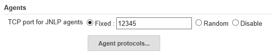
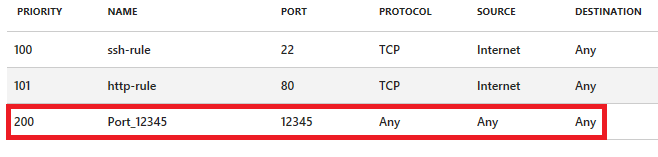
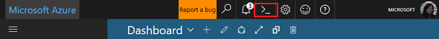
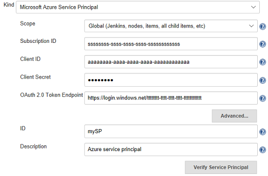
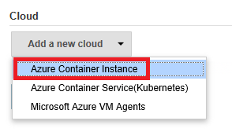
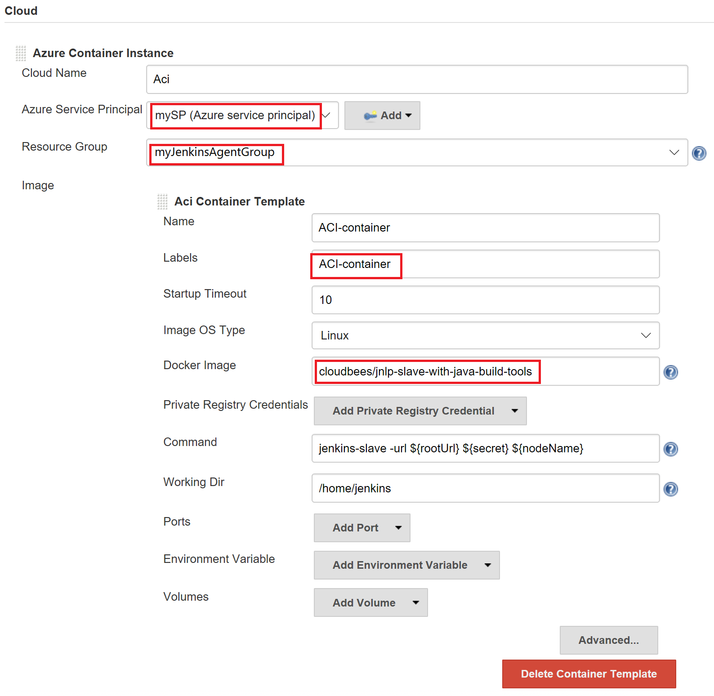
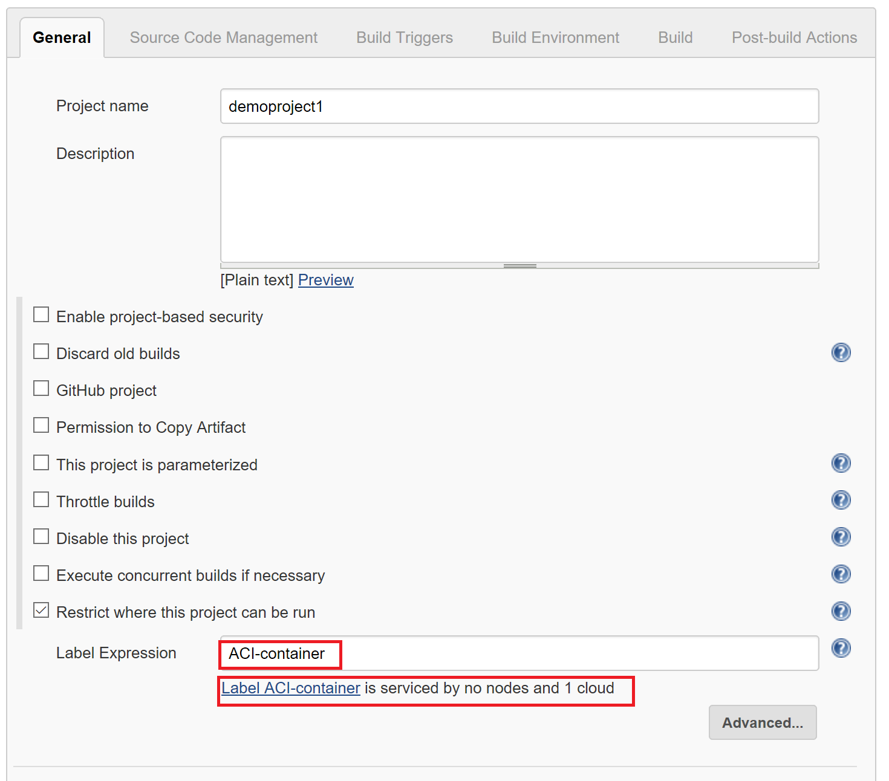
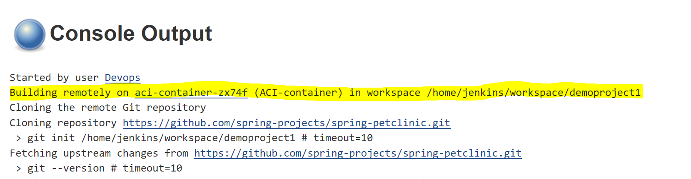

# Propose

This quickstart shows you how to spin up a container agent in Azure in your existing Jenkins master.

# Time to complete

10 minutes

# Scenario

Use Azure Container agent to add on-demand capacity and use [Azure Container Instances](https://docs.microsoft.com/en-us/azure/container-instances/) to build the Spring PetClinic Sample Applicaiton.

<br>
<a class="tutorial-next-btn" style="background-color:#68217A" onclick="logClick('/Jenkins/aaa/introduction-completed')" href="something.md">Let's get started!</a>
</br>

# Prerequisuites

1. If you don't have an Azure subscription, create a free account before you begin. <br/>
<a class="tutorial-next-btn" style="background-color:#68217A" href="https://azure.microsoft.com/pricing/free-trial/" target="_blank">Create your free Azure account</a>


2. A Jenkins master server. If you don't have one, view the quickstart to set up one in Azure. <br/>
<a class="tutorial-next-btn" style="background-color:#68217A" href="https://docs.microsoft.com/en-us/azure/jenkins/install-jenkins-solution-template/" target="_blank">Create your Jenkins Master</a>

3. Make sure you update the Jenkins DNS name in **Managed Jenkins** -> **Configure System** -> **Administrative monitors configuration** -> **Jenkins URL** 

4. Since the slave/agent connects with master via JNLP, make sure JNLP is allowed. In Jenkins, under **Configure Global Security** -> **TCP port for JNLP agents** - select "Fixed" use say 12345. 
Make sure you add an inbound security rule for the Jenkins master. In Azure, you need to add the rule in the Network Security Group for the Jenkins master:


## Create an Azure service principal and add to Jenkins credential store
1. If you don't already have an Azure service principal, go to [Azure Portal](https://portal.azure.com/) and launch [Cloud Shell](https://docs.microsoft.com/en-us/azure/cloud-shell/overview) from the top navigation.
 
2. Follow the instruction to select the environment and subscription to use.
3. In Cloud Shell, run:
    ```azurecli-interactive
    az ad sp create-for-rbac --name "uuuuuuuu" --password "pppppppp"
    ```
    Where uuuuuuuu is the user name and pppppppp is the password for the service principal.

4. Azure responds with JSON that resembles the following examples:

    ```json
    {
        "appId": "aaaaaaaa-aaaa-aaaa-aaaa-aaaaaaaaaaaa",
        "displayName": "uuuuuuuuuu",
        "name": "http://uuuuuuuu",
        "password": "pppppppp",
        "tenant": "tttttttt-tttt-tttt-tttt-tttttttttttt"
    }
    ```
    You will use the values from this JSON response when you add the Azure Service Principal to Jenkins using the Azure Credential plugin. The aaaaaaaa, uuuuuuuu, pppppppp, and tttttttt are placeholder values.

## Install the Azure plugins

> [!TIP]
> If you deployed Jenkins on Azure using the [solution template](install-jenkins-solution-template.md), the [Azure Credential Plugin] (https://plugins.jenkins.io/azure-credentials) and [Azure Container Agents](https://plugins.jenkins.io/azure-container-agents) are already installed.

1. From the Jenkins dashboard, select **Manage Jenkins**, then select **Manage Plugins**.
2. Select the **Available** tab, then search for **Azure Credentials** and **Azure Container Agents Plugin**. Select the checkbox next to the entry for the plugin and select **Install without restart** from the bottom of the dashboard.

## Add Azure service principal to Jenkins
1. From the Jenkins dashboard, select **Credentials**
2. Select **System** and then **Add Credentials**
3. In the **Add Credentials** dialog, select **Microsoft Azure Service Principal** from the **Kind** drop-down.
4. If you don't know your Azure subscription ID, you can query it from the Cloud Shell:
     
     ```azurecli-interactive
     az account list
     ```
     
     Enter your subscription ID. Use the `appId` value for **Client ID**, `password` for **Client Secret**, and a URL for **OAuth 2.0 Token Endpoint** of `https://login.windows.net/<tenant_value>`. 
     
     Provide "mySP" as the ID for this crediatial and provide a description.

     

    Verify the service principal authenticates with Azure by selecting **Verify Service Principal**
    
    <br>
    <a class="tutorial-issue-btn" onclick="reportIssue('/Java/hello-world/', 'deploy');logClick('/Java/hello-world/deploy-issuereport');" href="javascript:void(0)">I ran into an issue</a>&nbsp; &nbsp; &nbsp; &nbsp;<a class="tutorial-next-btn" onclick="logClick('/Java/hello-world/deploy-completed')" href="finished.html">I have added Azure Service principal in Jenkins</a>

## Create a resource group for Azure Container Instances
Azure Container Instances (ACI) makes it easy for you to get up and running without having to provision virtual machines or adopt a higher-level service. ACI must be placed in an Azure resource group. Create a resource group with the az group create command.  

1. In Cloud Shell:
     
     ```azurecli-interactive
     az group create --name myJenkinsAgentGroup --location eastus
     ```   

    <br>
    <a class="tutorial-issue-btn" onclick="reportIssue('/Java/hello-world/', 'deploy');logClick('/Java/hello-world/deploy-issuereport');" href="javascript:void(0)">I ran into an issue</a>&nbsp; &nbsp; &nbsp; &nbsp;<a class="tutorial-next-btn" onclick="logClick('/Java/hello-world/deploy-completed')" href="finished.html">I have created a resource group for ACI</a>

## Configure the Azure Container Agents plugin

1. From the Jenkins dashboard, select **Manage Jenkins**, then **Configure System**.
2. Scroll to the bottom of the page and find the **Cloud** section with the  **Add new cloud** dropdown and choose **Azure Credential Instance**.

3. Select "mySP" from the **Azure Service Principal** dropdown. 
4. In the **Resource Group Name** section, select `myJenkinsAgentGroup`.
5. Under **Aci container Template**, enter "ACI-container" for both Name and Labels.
6. Enter "cloudbees/jnlp-slave-with-java-build-tools" for Docker Image.

5. Select **Save** to update the plugin configuration.

<br>
    <a class="tutorial-issue-btn" onclick="reportIssue('/Java/hello-world/', 'deploy');logClick('/Java/hello-world/deploy-issuereport');" href="javascript:void(0)">I ran into an issue</a>&nbsp; &nbsp; &nbsp; &nbsp;<a class="tutorial-next-btn" onclick="logClick('/Java/hello-world/deploy-completed')" href="finished.html">I have configured Azure container agent in Jenkins</a>

## Create a job in Jenkins

1. Within the Jenkins dashboard, click **New Item**. 
2. Enter `demoproject1` for the name and select **Freestyle project**, then select **OK**.
3. In the **General** tab, choose **Restrict where project can be run** and type `ACI-agent` in **Label Expression**. You see a message confirming that the label is served by the cloud configuration created in the previous step. 
   
4. In the **Source Code Management** tab, select **Git** and add the following URL into the **Repository URL** field: `https://github.com/spring-projects/spring-petclinic.git`
5. In the **Build** tab, select **Add build step**, then **Invoke top-level Maven targets**. Enter `package` in the **Goals** field.
6. Select **Save** to save the job definition.

<br>
    <a class="tutorial-issue-btn" onclick="reportIssue('/Java/hello-world/', 'deploy');logClick('/Java/hello-world/deploy-issuereport');" href="javascript:void(0)">I ran into an issue</a>&nbsp; &nbsp; &nbsp; &nbsp;<a class="tutorial-next-btn" onclick="logClick('/Java/hello-world/deploy-completed')" href="finished.html">I have created a new Job</a>

## Build the new job on an Azure Container agent

1. Go back to the Jenkins dashboard.
2. Select the job you created in the previous step, then click **Build now**. A new build is queued, but does not start until an ACI agent  is created in your Azure subscription.
3. Once the build is complete, go to **Console output**. Click **Full log** to see that the build was performed remotely on an Azure agent.


<br>
    <a class="tutorial-issue-btn" onclick="reportIssue('/Java/hello-world/', 'deploy');logClick('/Java/hello-world/deploy-issuereport');" href="javascript:void(0)">I ran into an issue</a>&nbsp; &nbsp; &nbsp; &nbsp;<a class="tutorial-next-btn" onclick="logClick('/Java/hello-world/deploy-completed')" href="finished.html">I have successfully run the build remotely!</a>
